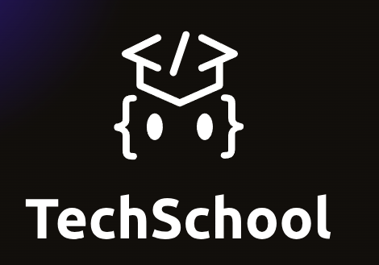

# 🌀 Taller de Portafolio con Tailwind CSS Recursos para Estudiantes

## 🧠 Descripción del Repositorio

Este repositorio forma parte del **taller de creación de portafolios con Tailwind CSS**, desarrollado durante el evento **TechSchool Puerto Montt 2025**.

A diferencia de un repositorio tradicional, **este proyecto no contiene código fuente preconstruido**. En su lugar, entrega la **estructura de carpetas** e **imágenes necesarias** para que los estudiantes construyan su portafolio de forma progresiva, **escribiendo su propio código desde cero** como parte del proceso de aprendizaje.

---

## 🎯 Propósito Educativo

- Facilitar el desarrollo **autónomo y guiado** de un portafolio web.
- Fomentar el uso de **HTML5 y Tailwind CSS** como herramientas modernas de diseño web.
- Promover la **autoconstrucción del conocimiento** mediante la creación práctica.
- Apoyar la vinculación entre **estudiantes, docentes y comunidad tecnológica local**.

Este recurso ha sido desarrollado con el apoyo del **CITT** y la **Escuela de Informática y Telecomunicaciones** de **Duoc UC, sede Puerto Montt**, promoviendo una enseñanza activa, visual y centrada en la práctica.

---

## 🧩 Enlaces de Apoyo

🔗 **Guía paso a paso del taller (Notion):**  
[https://quilt-canary-969.notion.site/Taller-de-Tailwind-Estudiante-2045b3c4e312808eb878db80743ebe7a](https://quilt-canary-969.notion.site/Taller-de-Tailwind-Estudiante-2045b3c4e312808eb878db80743ebe7a?source=copy_link)

🔗 **Ejemplo final publicado (GitHub Pages):**  
[https://marcelo-crisostomo.github.io/Tailwind_Portafolio/](https://marcelo-crisostomo.github.io/Tailwind_Portafolio/)

🔗 **Carpeta Drive Video :**  
[https://drive.google.com/drive/folders/15r_TKOlitZyJJHdsoEUjdd4QHAsrSbok?usp=sharing](https://drive.google.com/drive/folders/15r_TKOlitZyJJHdsoEUjdd4QHAsrSbok?usp=sharing)

🔗 **Sitio Web TechSchool :**  
[https://techschool-latam.com/](https://techschool-latam.com/)

---

## 📄 Licencia

Este recurso es de uso **educativo y libre de fines comerciales**. Puedes modificarlo, compartirlo y adaptarlo.

---

Hecho con 🔥 por **Marcelo Crisóstomo Carrasco**  
Docente - Escuela de Informática y Telecomunicaciones, Duoc UC Puerto Montt para techSchool 2025

