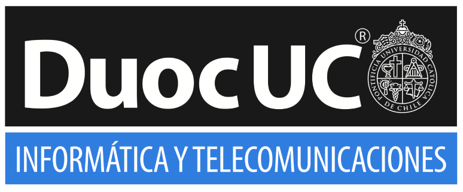

# 🌀 Portafolio con Tailwind CSS

## 🧠 Descripción del proyecto

Este repositorio contiene un portafolio personal desarrollado como parte del **taller de creación de portafolios con Tailwind CSS** realizado en el evento **TechSchool Puerto Montt 2025**.

El portafolio fue construido utilizando **HTML5** y **Tailwind CSS**, aplicando principios de diseño responsivo, buenas prácticas en frontend, y enfocado en presentar de forma clara los proyectos y habilidades de un desarrollador en formación.

## 🎯 Propósito

- Mostrar el uso práctico de Tailwind CSS en la creación de un sitio web moderno.
- Servir como ejemplo para quienes deseen crear su propia landing profesional.
- Difundir la participación en TechSchool y la vinculación con la comunidad tecnológica del sur de Chile.

Este trabajo forma parte de las actividades impulsadas por el **CITT** y la **Escuela de Informática y Telecomunicaciones** de **Duoc UC, sede Puerto Montt**, donde se promueve el aprendizaje práctico y colaborativo.

## 🔗 Enlace guía del taller 

 [Ver portafolio publicado](https://marcelo-crisostomo.github.io/Tailwind_Portafolio/)

## 🔗 Enlace Guía online de Notion
 [Ver portafolio publicado](https://quilt-canary-969.notion.site/Taller-de-Tailwind-Estudiante-2045b3c4e312808eb878db80743ebe7a?source=copy_link)

## 📄 Licencia

Este proyecto se comparte con fines educativos y sin fines de lucro. Si lo usas, no olvides mencionar la fuente o dejar una estrella ⭐ en GitHub.

---

Hecho con 🔥 por **Marcelo Crisóstomo Carrasco**